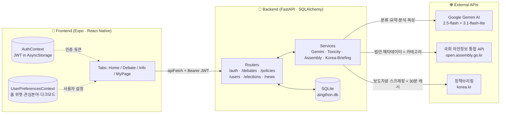
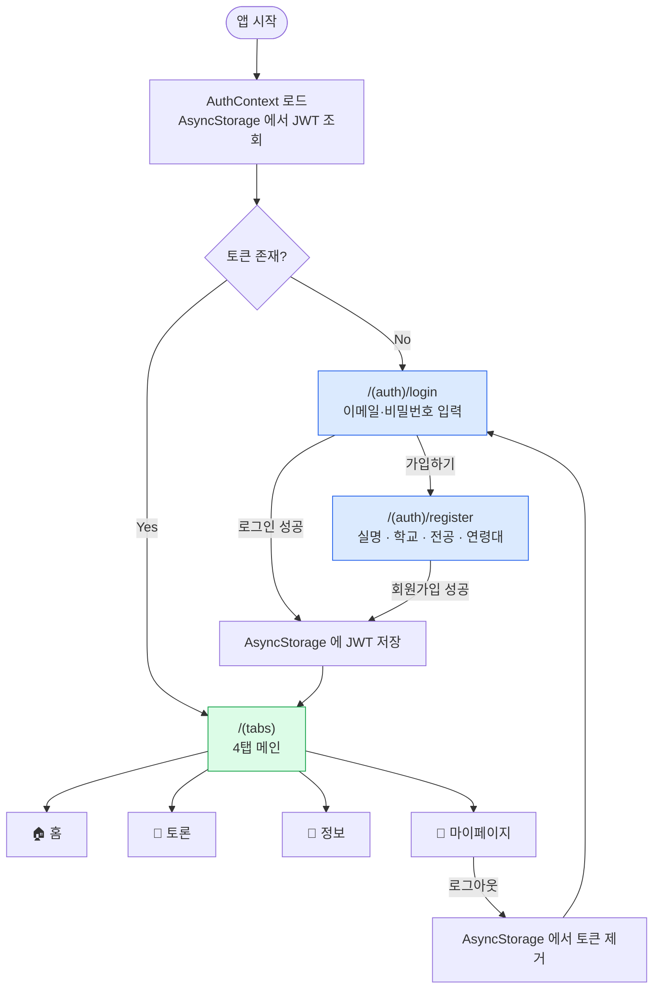
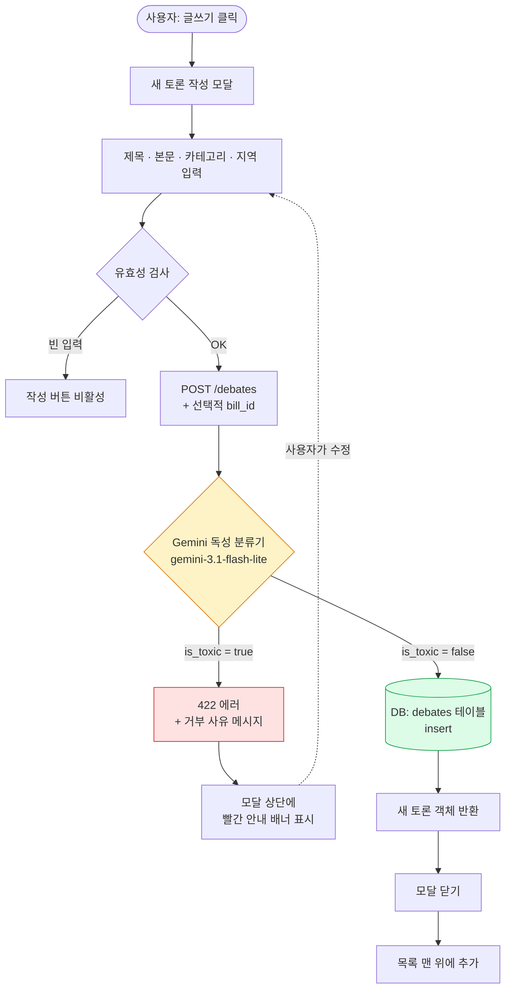
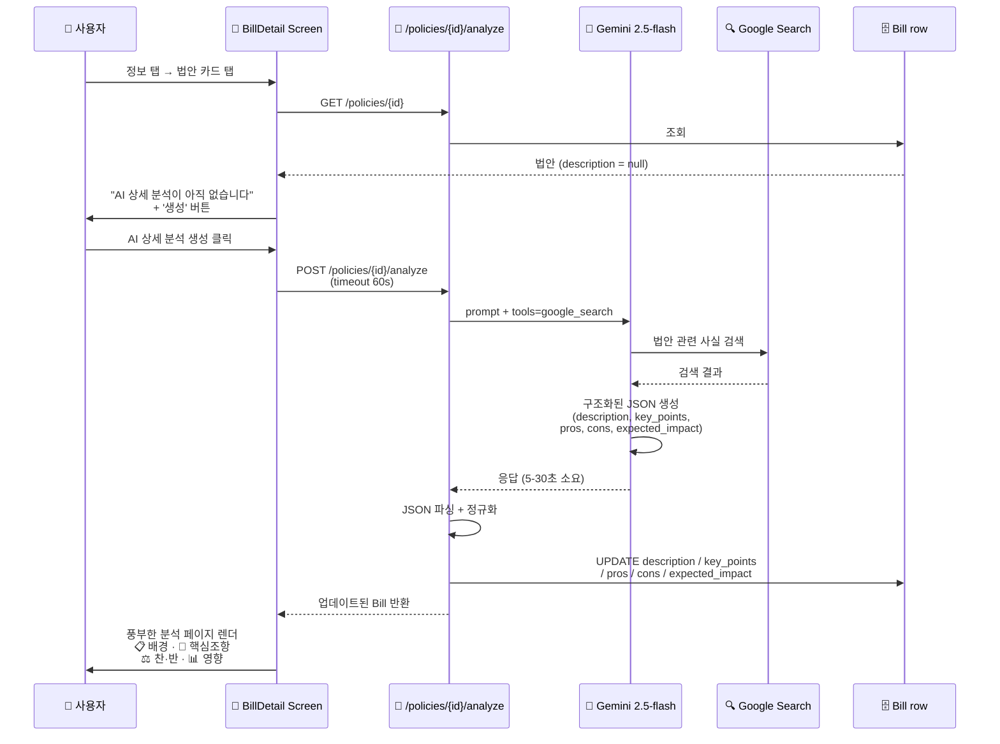
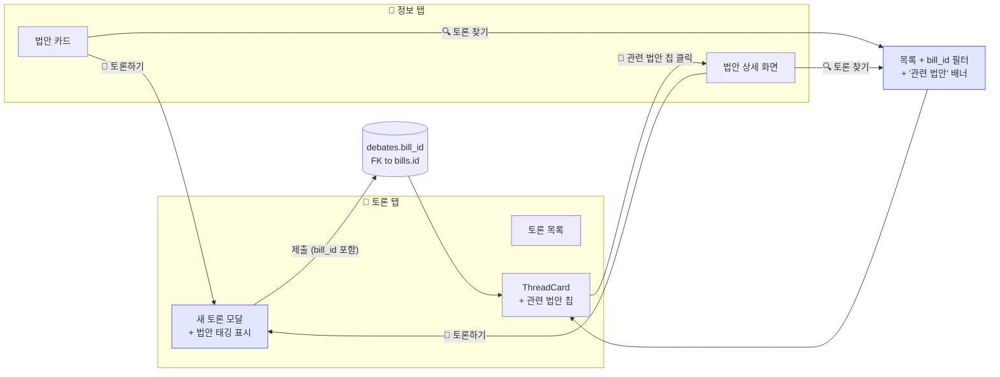
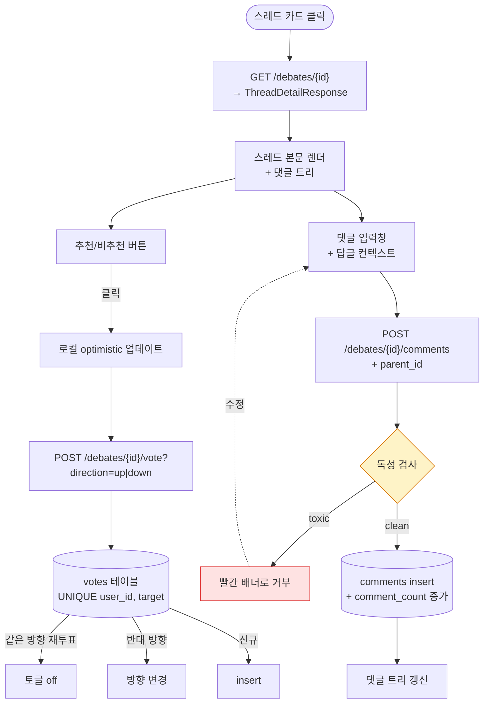
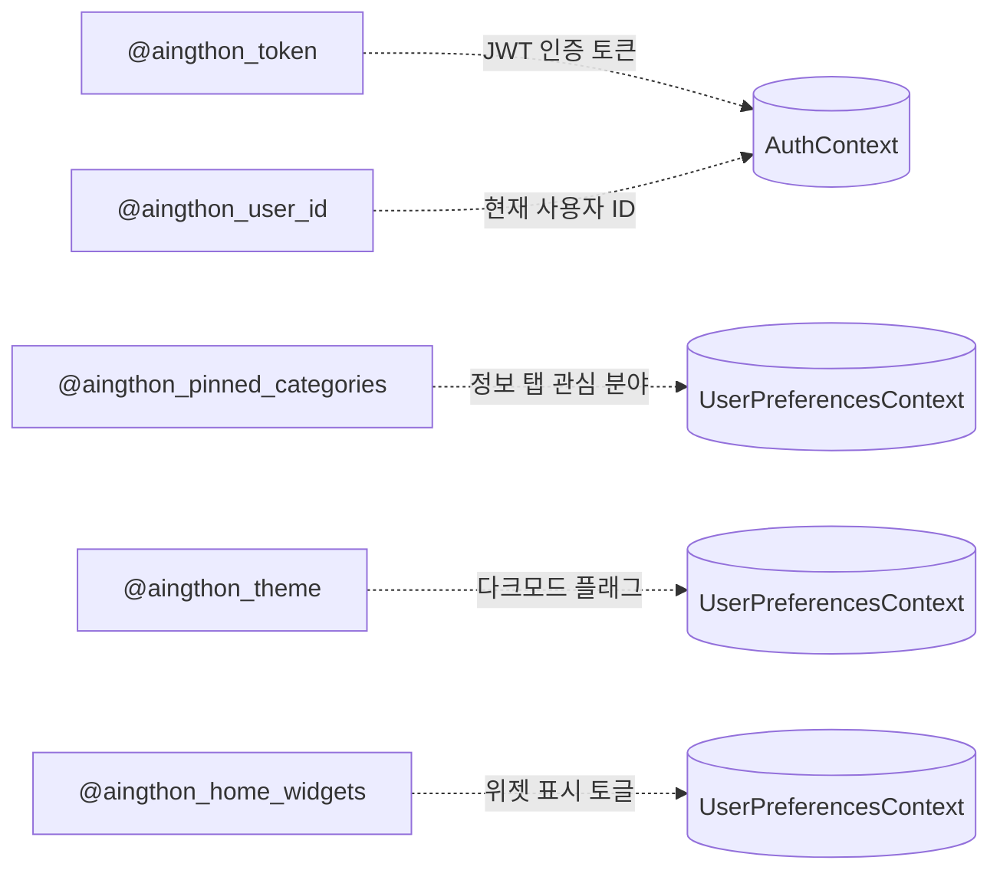
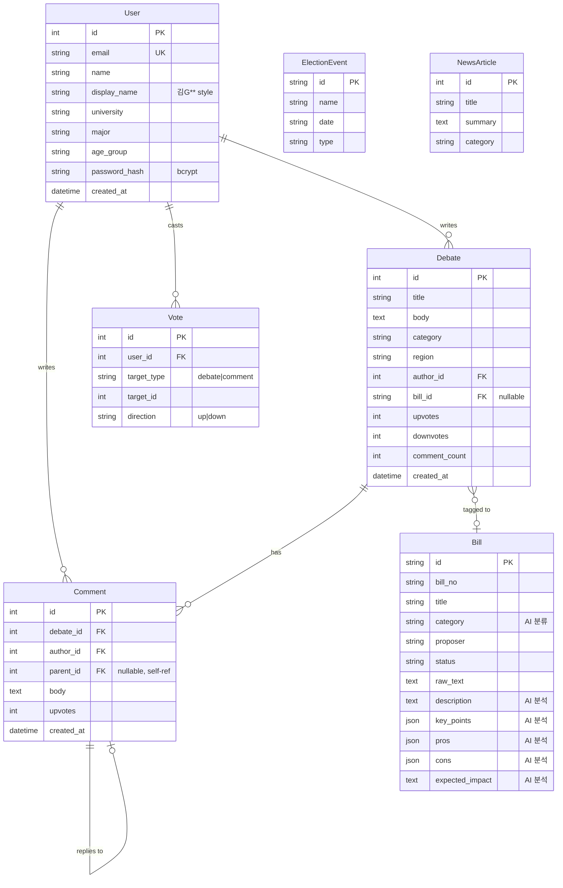
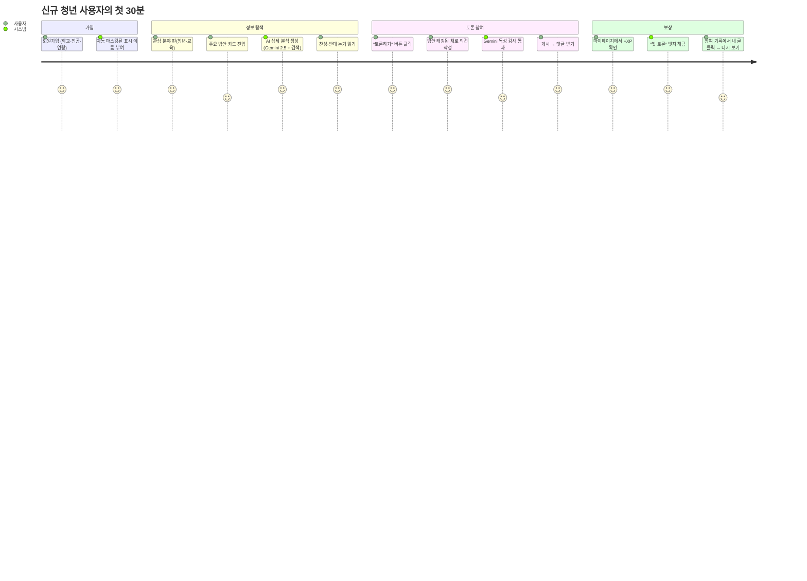
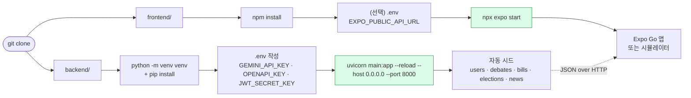

# Agora — 서비스 플로우차트

> 청년 정책 토론 플랫폼 **Agora** 의 주요 기능 흐름과 데이터 통합을 시각화한 문서입니다.
> 모든 다이어그램은 [Mermaid](https://mermaid.js.org/) 문법으로 작성되어 GitHub에서 자동 렌더링됩니다.

---

## 1. 전체 시스템 아키텍처



---

## 2. 인증 & 라우팅 게이트



---

## 3. 홈 탭 — 위젯 커스터마이즈

```mermaid
flowchart TD
    Open([홈 탭 진입]) --> Parallel[4개 API 병렬 fetch]
    Parallel --> E["/elections<br/>선거 일정"]
    Parallel --> T["/debates/trending<br/>인기 토론 TOP 3"]
    Parallel --> B["/policies?<br/>주요 법안 (최신 4)"]
    Parallel --> A["/news/announcements<br/>정부 발표 (15초 timeout)"]

    A --> KoreaKr{30분 캐시 hit?}
    KoreaKr -->|Yes| ReturnCache[캐시 반환]
    KoreaKr -->|No| Scrape[korea.kr 라이브 스크래핑]
    Scrape --> Parse[정규식으로<br/>title · ministry · date 추출]
    Parse --> Save[캐시 저장 + 반환]

    E --> Render[홈 화면 렌더]
    T --> Render
    B --> Render
    ReturnCache --> Render
    Save --> Render

    Render --> Pinned[📌 관심 분야 칩]
    Render --> Widgets{homeWidgets 토글 확인}

    Widgets -->|announcements ✓| AnnStrip[📢 정부 발표<br/>vertical auto-scroll<br/>220px 고정 높이]
    Widgets -->|elections ✓| ElStrip[🗓 선거 일정<br/>horizontal auto-scroll<br/>~2 카드 노출]
    Widgets -->|trending ✓| TList[🔥 인기 토론 TOP 3]
    Widgets -->|bills ✓| BList[📑 주요 법안 4건]

    Open -->|"⚙️ Customize"| Modal[맞춤 설정 모달]
    Modal -->|"Switch 토글"| Persist[(AsyncStorage<br/>@aingthon_home_widgets)]
    Persist -.리렌더.-> Widgets
```

---

## 4. 토론 작성 — Gemini 독성 필터 게이트



---

## 5. 정보 탭 — 정부 데이터 동기화 + 자동 카테고리 분류

```mermaid
flowchart TD
    User([사용자: '🔄 정부 데이터' 클릭]) --> Refresh["POST /policies/refresh"]

    Refresh --> Fetch[국회 의안정보 통합 API 호출<br/>TVBPMBILL11<br/>+ KEY · Type=json · AGE=22]
    Fetch --> ParseRows["응답 파싱 → row 배열<br/>(BILL_ID, BILL_NAME, PROPOSE_DT,<br/>PROPOSER_KIND, LINK_URL ...)"]

    ParseRows --> Build[1차 패스: 메타데이터만 빌드<br/>category = '기타']

    Build --> Classify{"Gemini 일괄 분류<br/>gemini-3.1-flash-lite"}
    Classify -->|"성공"| Apply[각 법안에 카테고리 적용<br/>청년/교육/경제/복지/환경/주거/고용/보건]
    Classify -->|"기타 반환"| Keyword[키워드 매칭 fallback]
    Keyword -->|매치| ApplyKw[키워드 카테고리 적용]
    Keyword -->|매치 실패| Stay기타[category = '기타' 유지]

    Apply --> Upsert
    ApplyKw --> Upsert
    Stay기타 --> Upsert

    Upsert{"DB upsert"}
    Upsert -->|"존재 ID"| Update[메타만 업데이트<br/>AI 큐레이션 필드는 보존]
    Upsert -->|"신규 ID"| Insert[추가 + key_points/pros/cons = []]

    Update --> Result[결과 반환<br/>{ inserted, updated, total }]
    Insert --> Result
    Result --> Toast[프론트에 토스트<br/>총 N건 동기화 완료]

    style Classify fill:#fef3c7,stroke:#d97706
    style Upsert fill:#dbeafe,stroke:#2563eb
```

---

## 6. 법안 상세 — 그라운딩 기반 AI 분석



---

## 7. 법안 ↔ 토론 크로스 링킹



---

## 8. 마이페이지 — 활동 통계 & 게이미피케이션

```mermaid
flowchart TD
    Enter([마이페이지 진입]) --> Fetch[병렬 fetch]
    Fetch --> Me["/users/me"]
    Fetch --> Lvl["/users/me/level"]
    Fetch --> Bdg["/users/me/badges"]
    Fetch --> Hist["/users/me/history?limit=50"]

    Lvl --> Calc["XP = threads×30 + comments×10 + upvotes×3<br/>레벨 = thresholds 매핑"]
    Calc --> Render[프로필 카드 + 레벨 + XP 바<br/>+ 5단계 로드맵]

    Bdg --> BadgeGrid[10개 뱃지 그리드<br/>잠김/해금]
    Hist --> HistList[참여 기록 (최대 50건)<br/>+ 토론/댓글 필터 칩]

    Render --> StatGrid[4-stat 그리드<br/>토론/공감/댓글/주간]

    StatGrid -->|"📝 작성 토론 탭"| ListThreads["/profile/activities?type=thread<br/>토론만 필터링된 전체 목록"]
    StatGrid -->|"💬 댓글 탭"| ListComments["/profile/activities?type=comment<br/>댓글만 필터링된 전체 목록"]
    HistList -->|"항목 클릭"| Thread["/thread/{id}"]
    ListThreads -->|"항목 클릭"| Thread
    ListComments -->|"항목 클릭"| Thread

    Render -->|"편집 버튼"| EditModal[프로필 편집 모달]
    EditModal -->|"저장"| Patch["PATCH /users/me<br/>학교·전공·연령대 수정"]
    Patch --> Render
```

---

## 9. 토론 스레드 상세 — 중첩 댓글



---

## 10. 외부 API 호출 요약

| 외부 서비스 | 용도 | 호출 위치 | 캐싱 전략 |
|---|---|---|---|
| **Google Gemini 3.1-flash-lite** | 법안 3-bullet 요약, 카테고리 분류, 댓글/글 독성 검사 | `services/gemini.py`, `services/toxicity.py` | bill_id 별 in-memory cache (요약) |
| **Google Gemini 2.5-flash + Search Grounding** | 법안 상세 분석 (description / key_points / pros / cons / expected_impact) | `_analyze_sync` | DB 영구 저장 (description 존재 시 skip) |
| **국회 의안정보 통합 API (TVBPMBILL11)** | 법안 메타데이터 동기화 | `services/assembly.py` | DB upsert (큐레이션 필드 보존) |
| **정책브리핑 (korea.kr)** | 최신 정부 발표 (보도자료) | `services/korea_briefing.py` | 30분 in-memory cache |

---

## 11. 영속성 (AsyncStorage 키)



---

## 12. DB 엔티티 관계



---

## 13. 핵심 사용자 여정 — 처음 사용 시나리오



---

## 14. 로컬 실행 흐름



---

> **작성일**: 2026-05-10
> **앱 버전**: Agora v0.3 (백엔드) · 1.0.0 (Expo)
> 모든 다이어그램은 GitHub README 미리보기에서 자동 렌더링됩니다.
